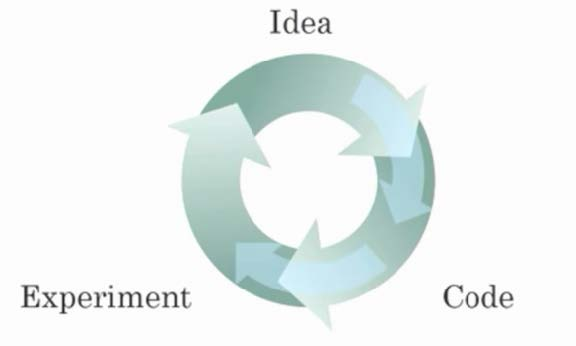
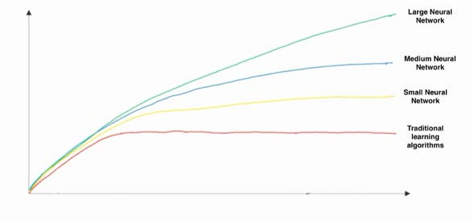

# 1. What does the analogy “AI is the new electricity” refer to?
- A. AI runs on computers and is thus powered by electricity, but it is letting computers do things not possible before.
- B. AI is powering personal devices in our homes and offices, similar to electricity.
- C. Through the “smart grid”, AI is delivering a new wave of electricity.
- D. Similar to electricity starting about 100 years ago, AI is transforming multiple industries.

*Ans: D*

# 2. Which of these are reasons for Deep Learning recently taking off? (Check the three options that apply.)
- A. Neural Networks are a brand new field.
- B. We have access to a lot more data.
- C. We have access to a lot more computational power.
- D. Deep learning has resulted in significant improvements in important applications such as online advertising, speech recognition, and image recognition.

*Ans: B, C, D*

# 3. Recall this diagram of iterating over different ML ideas. Which of the statements below are true? (Check all that apply.)

- A. Being able to try out ideas quickly allows deep learning engineers to iterate more quickly.
- B. Faster computation can help speed up how long a team takes to iterate to a good idea.
- C. It is faster to train on a big dataset than a small dataset.
- D. Recent progress in deep learning algorithms has allowed us to train good models faster (even without changing the CPU/GPU hardware).

*Ans: A, B, D*

# 4. When an experienced deep learning engineer works on a new problem, they can usually use insight from previous problems to train a good model on the first try, without needing to iterate multiple times through different models. True/False?
- A. True
- B. False

*Ans: A*
*True Ans: B **Maybe some experience may help, but nobody can always find the best model or hyperparameters without iterations.***

# 5. Which one of these plots represents a ReLU activation function?

*Ans: choose the pic which is like function f(x) = max(0, x)*

# 6. Images for cat recognition is an example of “structured” data, because it is represented as a structured array in a computer. True/False?
- A. True
- B. False

*Ans: B*

# 7. A demographic dataset with statistics on different cities' population, GDP per capita, economic growth is anexample of “unstructured” data because it contains data coming from different sources. True/False?
- A. True
- B. False

*Ans: B*

# 8. Why is an RNN (Recurrent Neural Network) used for machine translation, say translating English to French? (Check all that apply.)
- A. It can be trained as a supervised learning problem.
- B. It is strictly more powerful than a Convolutional Neural Network (CNN).
- C. It is applicable when the input/output is a sequence (e.g., a sequence of words).
- D. RNNs represent the recurrent process of Idea->Code->Experiment->Idea->....

*Ans: A, C*

# 9. In this diagram which we hand-drew in lecture, what do the horizontal axis (x-axis) and vertical axis (y-axis) represent?

- A. x-axis is the amount of data, y-axis is the size of the model you train.
- B. x-axis is the input to the algorithm, y-axis is outputs.
- C. x-axis is the amount of data, y-axis (vertical axis) is the performance of the algorithm.
- D. x-axis is the performance of the algorithm, y-axis (vertical axis) is the amount of data.

*Ans: C*

# 10. Assuming the trends described in the previous question's figure are accurate (and hoping you got the axis labels right), which of the following are true? (Check all that apply.)
- A. Increasing the training set size generally does not hurt an algorithm’s performance, and it may help significantly.
- B. Decreasing the size of a neural network generally does not hurt an algorithm’s performance, and it may help significantly.
- C. Increasing the size of a neural network generally does not hurt an algorithm’s performance, and it may help significantly.
- D. Decreasing the training set size generally does not hurt an algorithm’s performance, and it may help significantly.

*Ans: A*
*True Ans: A, B*

