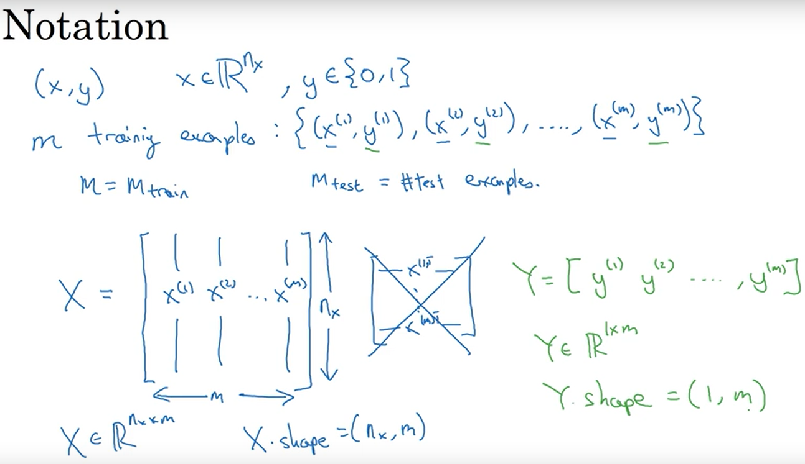
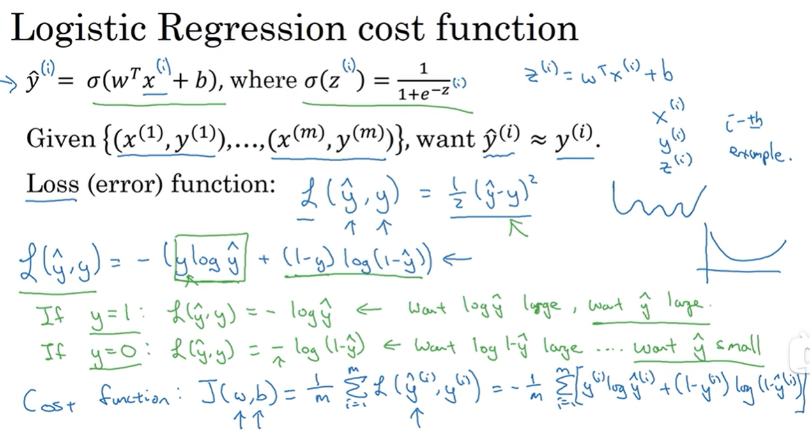
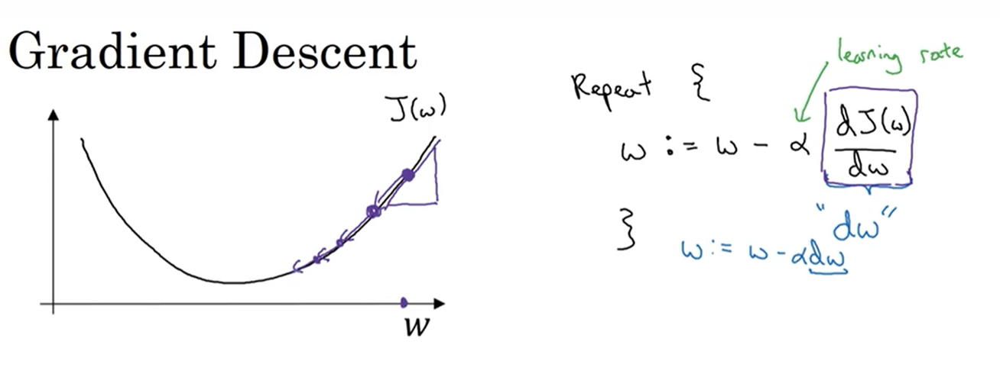
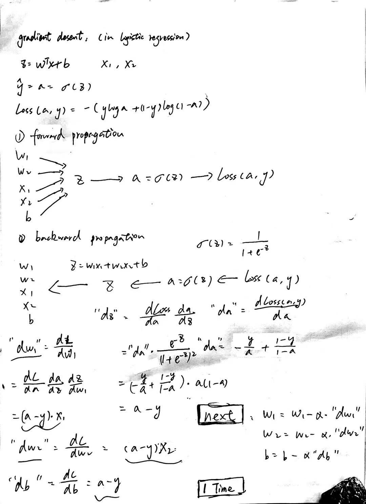
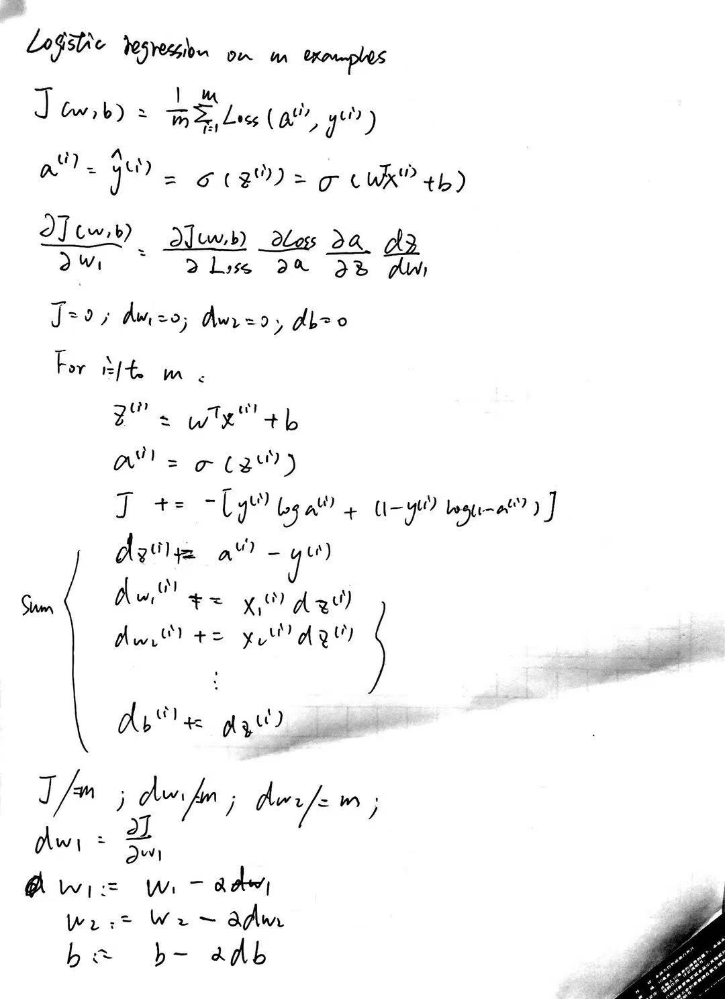

# 2.1 binary classification
### some tips
1. if had m training set, it usually don't use for loop.
2. it have forward propagation step and backward propagation step.
### example logistic regression cat classification
1. 1(cat) vs 0(non cat)
2. if input image is 64x64 pixels RGB image, then it will be **64x64x3** pixel intensity values into features vector x = [col(64x64x3=12288)]
3. nx = 12288
4. x --> y
### notation

- (x, y), x∈Rnx, y∈{0, 1}
- m, traning example: {(x1, y1), (x2, y2),...,(xm, ym)}
- X = [x1, x2,..., xm], (12288 x m matrix)
- Y = [y1, y2,..., ym], (1 x m matrix)

# 2.2 logistic regression use notation
### 
- Given x, want y_preidct = P(y=1|x), means y_predict [0, 1], so relu or sigmod will be use
- Parameters: **W**, **b**
- Output: y_predict = sigmod(W_T**x**+b)

# 2.3 cost funtion in logistic regression

- Loss (error) function: L(y_pred, y) = -(ylogy_pred + (1-y)log(1-y_pred)), prove: if you let y = 1, that means you want y_pred as big as possible but no bigger than 1, because sigmod function
- Cost function: J(w, b) = 1/m x sum(L(y_pred, y))
- Loss function is represent one single training sample, Cost function in represent all training good or not. 

# 2.4 how to use gradient desent to train w and b
### example

- let's do a J(w) (simple function like y = x^2)'s gradient desent.
- repeat { w:= w - α(dJ(w)/dw) as dw in code; b:= b - α(dJ(w)/dw as db in code}, α: learning rate

# 2.5, 2.6 calculus and derivatives
- that part is quite easy, but i still not skip it.
- treat derivatives as slope

# 2.7, 2.8 computation graph
### example
J(a, b, c) = 3(a + bc)
- u = bc, v = a + u, J = 3v
- forward propagation, just compute it.
- back propagation means chain rule, how a changes infect J, it called dvar in code.

# 2.9 implement gradient desent for one sample logistic regression
### example
- z = w_T + b
- y_pred = a = sigmod(z)
- Loss(a, y) = -(yloga + (1-y)loga)
- if we have x1, x2 vector
- write on a papper


# 2.10 implement gradient desent for m training sample logistic regression
### example
- just write on a paper


# 2.11 vectorized
- vectorized:
```python
import numpy as np

a = np.random.rand(1000000)
b = np.random.rand(1000000)

c = np.dot(a, b)
```
- non-vectorized:
```python
import numpy as np

a = np.random.rand(1000000)
b = np.random.rand(1000000)
c = 0

for i in range(1000000):
  c += a[i] * b[i]
```
### *the result shows that vectorized code is faster than non-vectorized code*

# 2.12 Neural network programming guideline
- whenever possible, avoid exlicit for-loops.

# 2.13, 2.14 vectorizing logistic regression (important)
- X = [x1, x2,..., xm], w_T = [w1, w2,..., wm], x1 = [12288 col vector]
- Z = np.dot(w.T, X) + b = [w_Tx1+b, w_Tx2+b,..., w_txm+b]
- A = [a1, a2,..., am]
### backward propagation
- dZ = [dz1, dz2,..., dzm]
- Y = [y1, y2,..., ym]
- dZ = A - Y
- write on a paper


# 2.15 brocasting
### example
- (3, 4) matrix can devide by (1, 4) matrix
- python will copy (1, 4) matrix 3 times and expand to (3, 4) matrix

# 2.16 tips and tricks to bug-free python
```python
import numpy as np

a = np.random.rand(5)  # shape(5, ), do not use it
# recommand
a = np.random.rand(5, 1)  # shape(5, 1)
```

# 2.17 ipython, jupyter


